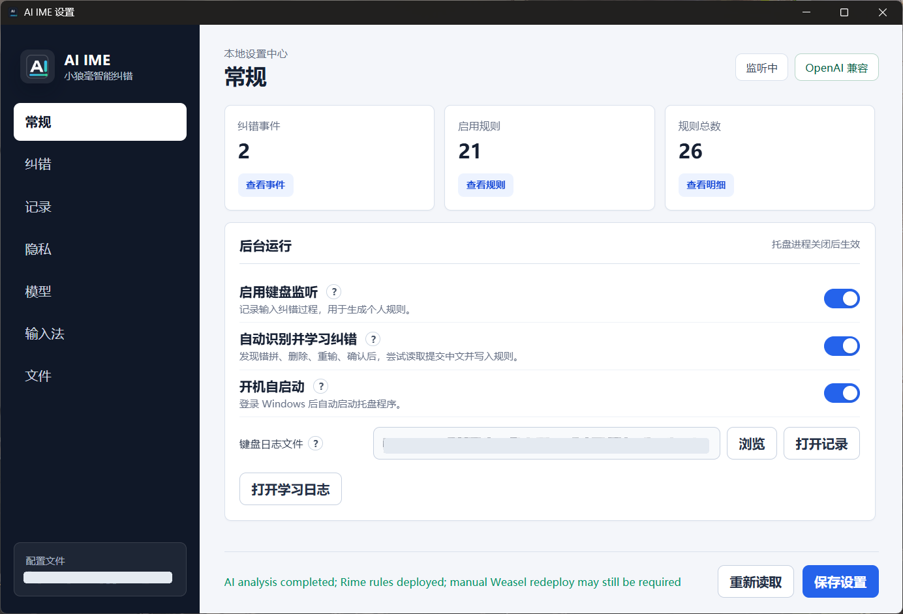
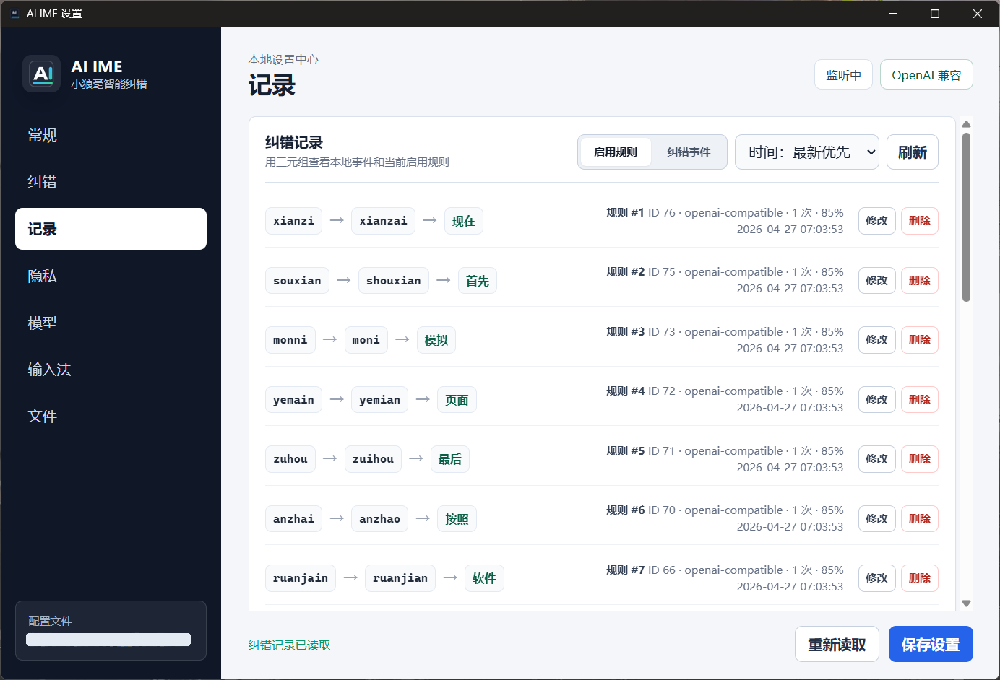

# AI IME

AI IME 是一个面向 Windows + 小狼毫/Rime + 雾凇拼音的拼音纠错学习助手。

它不是语音输入，也不会一次生成一大段文字。它的目标很窄：观察你经常打错的拼音，例如把 `xianzai` 误打成 `xainzai`，在你改正后学习这条习惯，下次输入错误拼音时让小狼毫优先给出正确候选词。

当前状态：Alpha。适合愿意尝鲜的 Windows 用户；正式安装包仍在建设中。

## 效果预览

示例截图中的本地文件路径已做脱敏处理。





## 适合谁

- 你主要用拼音输入中文。
- 你不想要“AI 帮你写一段话”，只想要更懂你输入习惯的纠错。
- 你愿意使用小狼毫/Rime + 雾凇拼音作为输入法底座。

AI IME 目前不能直接改造微软拼音、搜狗输入法等闭源输入法。它通过写入小狼毫/Rime 的本地词典和配置来影响候选词。

## 前置输入法

推荐先完成：

1. 安装小狼毫/Rime。
2. 安装 [雾凇拼音 rime-ice](https://github.com/iDvel/rime-ice)。
3. 在小狼毫中选择“雾凇拼音”方案。
4. 再运行本项目的 `START_HERE.cmd`。

小狼毫官方下载页：<https://rime.im/download/>

可参考这两个视频教程：

- [RIME小狼毫+雾凇具体简单部署](https://www.bilibili.com/video/BV1J5UnB5Etu/)
- [RIME小狼毫+雾凇拼音配置教程 Windows 篇](https://www.bilibili.com/video/BV1FioQY8EXD/)

## 最简单开始

下载源码 zip 或 clone 仓库后，先运行根目录里的：

```text
START_HERE.cmd
```

这个入口会自动执行：

1. 检查是否安装 `uv`。
2. 安装 Python 依赖到本项目的 `.venv`。
3. 初始化本地设置、数据库和私有 `.env` 文件。
4. 检测小狼毫/Rime 和雾凇拼音配置。
5. 创建桌面快捷方式。
6. 启动右下角托盘程序。

如果没有安装小狼毫或雾凇拼音，脚本会用中文提示。AI IME 可以先启动设置界面，但没有小狼毫 + 雾凇拼音时不会改变输入法候选词。

## 已经会命令行

```powershell
git clone <your-repo-url>
cd ai-ime
powershell -ExecutionPolicy Bypass -File scripts/bootstrap.ps1
```

常用命令：

```powershell
uv run python run.py
uv run python run.py --status
uv run python run.py --stop
uv run python -m ai_ime doctor
```

## 第一次打开后做什么

1. 点击 Windows 右下角通知区域里的 `AI IME` 图标。
2. 在“模型”页面配置 OpenAI 兼容接口、Ollama 或其他供应商。
3. 在“输入法”页面确认 Rime 用户目录和方案 ID `rime_ice`，点击“部署纠错词典”。
4. 从小狼毫菜单执行一次“重新部署”。
5. 在“纠错”页面手动录入一条规则，或直接开始打字让它学习。

`.env` 文件只是本地私有配置文件，用来保存模型地址和 API Key。你不需要先手动编辑它；在设置界面保存模型配置后，程序会自动写入 `.env`。

## 验证一条纠错

手动录入最稳定：

```text
错误拼音：xainzai
正确拼音：xianzai
对应中文：现在
```

部署到小狼毫后，输入 `xainzai`，候选词中应该能看到“现在”。
纠错词典只应在完整错误拼音输入后生效；只输入 `x`、`xa` 这类短前缀时，不应把“现在”提前到候选前列。

自动学习推荐在记事本里测试：

```text
xainzai -> 选中错误词 -> 删除 -> xianzai -> 空格/回车/数字键选中“现在”
```

如果小狼毫 Lua 日志已部署，AI IME 会记录候选词上屏内容，模型能看到“错误拼音、错误候选词、正确拼音、正确候选词”的链路。

## 文件位置

默认数据目录：

```text
%LOCALAPPDATA%\AIIME
```

主要文件：

- `settings.json`：界面设置。
- `ai-ime.db`：纠错事件和规则。
- `keylog.jsonl`：键盘日志和 Rime 候选上屏记录。
- `learning.log`：学习和部署日志。
- `webview/`：设置窗口缓存。

Rime 文件会写入小狼毫用户目录，通常是：

```text
%APPDATA%\Rime
```

AI IME 默认会写入雾凇拼音方案 `rime_ice.custom.yaml`，同时写入 `ai_typo.dict.yaml`、`ai_typo.schema.yaml` 和 `lua/ai_ime_logger.lua`，并在 `.ai-ime-backups/` 中备份被改动的文件。

## 隐私默认值

- 本地监听默认开启。
- 本地完整 keylog 默认关闭。
- 完整 keylog 默认不会上传到云端模型。
- 只有指向本机 `localhost` / `127.0.0.1` / `::1` 的 Ollama 才会默认使用完整日志。
- 云端/中转模型只有在你明确开启“发送完整键入日志”后才会收到完整 keylog。
- 已保存纠错规则的三元组会随分析请求发送给模型，用于审查并删除明显不合理的旧规则；删除前会在本地校验规则 ID 和三元组完全匹配。

模型分析会把纠错事件、已保存规则和可选键盘日志整理成 JSON，并要求模型只返回标准规则 JSON。返回结果会经过本地 schema 校验后才写入或删除规则。

## 发布状态

当前还没有正式安装器。仓库已经提供：

- 源码运行入口：`START_HERE.cmd`
- 开发/体验脚本：`scripts/bootstrap.ps1`
- Windows one-folder 打包脚本：`scripts/build-release.ps1`
- GitHub Actions CI

后续正式 release 目标包括：Windows 安装器、开始菜单快捷方式、卸载器、用户数据保留/删除选项、签名和自动更新。

## 开发

```powershell
uv run python -m unittest discover -s tests
uv run python -m ai_ime.settings_window --smoke
uv build --no-sources
```

更多细节见：

- [Windows 快速开始](docs/quickstart-windows.md)
- [隐私说明](docs/privacy.md)
- [架构说明](docs/architecture.md)
- [Release 指南](docs/release.md)

## 生成说明

代码由 GPT-5.5 生成。

## License

MIT License. See [LICENSE](LICENSE).
