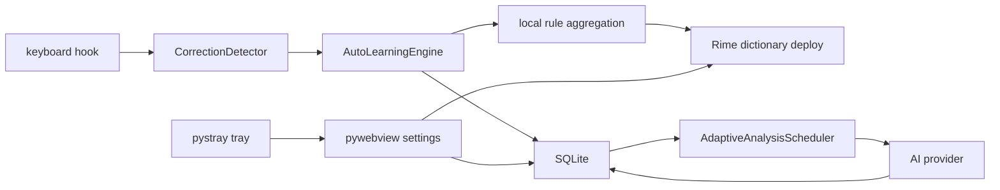

# 架构说明

AI IME 由一个 Windows companion app 和一组本地数据/规则模块组成。它不替换小狼毫输入法，而是在后台学习用户习惯，并把规则写入 Rime。

## 运行时流程

## 模块边界

- `ai_ime/app.py`：后台进程启动、停止、状态查询。
- `ai_ime/tray.py`：托盘生命周期、监听启停、设置窗口入口。
- `ai_ime/listener.py`：键盘事件归一化和可选完整日志写入。
- `ai_ime/correction/`：拼音序列检测，不依赖 UI 或数据库。
- `ai_ime/text_capture.py`：通过 Windows UI Automation 读取当前控件文本。
- `ai_ime/learning.py`：事件落库、规则聚合、Rime 部署。
- `ai_ime/analysis_scheduler.py`：按输入活跃度调整模型分析间隔。
- `ai_ime/providers/`：模型供应商适配层，统一输出 `LearnedRule`。
- `ai_ime/rime/`：Rime 文件渲染、部署、回滚、小狼毫部署器调用。
- `ai_ime/settings_window.py`、`ai_ime/ui/`：本地设置界面。
- `ai_ime/setup_wizard.py`：首次启动初始化和环境检查。

## 模型分析协议

AI 分析链路分三层：

1. `ai_ime/providers/prompt.py` 把纠错事件和可选键盘日志整理成 JSON 用户消息，并用系统提示词要求模型只返回规则 JSON。
2. `OpenAICompatibleProvider` 走 `/chat/completions`，默认附带 `response_format={"type":"json_object"}`；`OllamaProvider` 走 `/api/chat`，默认附带 `format="json"`。
3. `ai_ime/providers/schema.py` 解析、校验并归一化模型返回结果，只接受 `rules` 数组中的标准字段。

因此模型不会直接决定数据库结构；它只能建议规则，最终写入前必须通过本地 schema。

## 可扩展点

新增模型通道：

1. 在 `ai_ime/providers/` 下实现 `AIProvider`。
2. 在 `ai_ime/learning.py` 和 `ai_ime/ui_api.py` 的 provider factory 中注册。
3. 为请求、解析、错误处理添加测试。

如果新通道兼容 OpenAI Chat Completions，优先只在 `ai_ime/providers/presets.py` 添加接口预设，不要新增 SDK 依赖。

新增输入法后端：

1. 保持 `LearnedRule` 不变。
2. 新增后端部署模块，例如 `ai_ime/ime_backends/`。
3. 让 UI 配置选择后端，避免 Rime 逻辑泄漏到学习核心。

新增纠错识别规则：

1. 优先修改 `ai_ime/correction/detector.py`。
2. 添加序列级单元测试。
3. 不在监听器里写业务判断。

## 当前技术债

- `keyboard` 全局 hook 适合 Alpha，但长期需要更原生的 Windows/IME 集成。
- `uiautomation` 对不同应用兼容性不一致，自动学习失败时需要 UI 提示和手动补录兜底。
- Rime schema patch 需要继续增强冲突合并和多方案支持。
- 发布包需要补 Windows installer、签名、卸载清理和自动更新策略。
